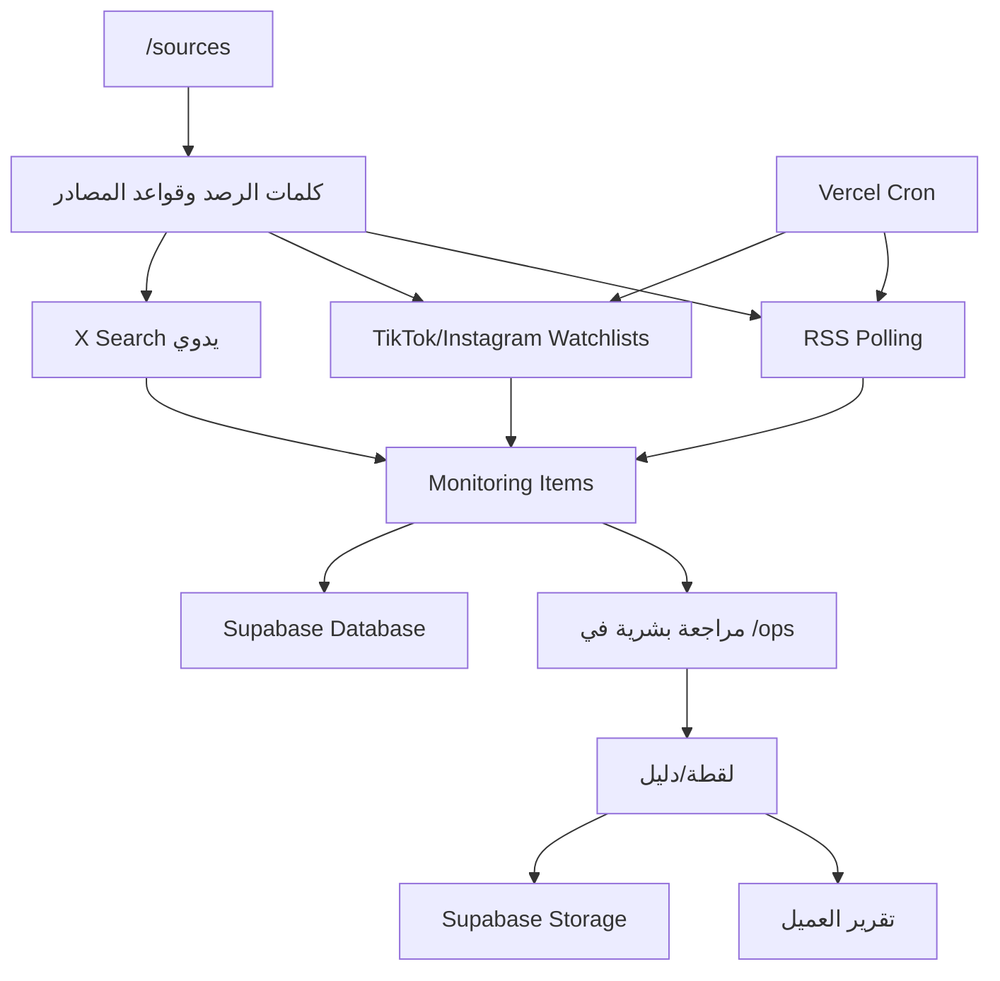

# دليل الخوادم والخدمات الخارجية لمنصة RASD

تاريخ المراجعة: 2026-05-23

هذا الملف يشرح الخدمات الخارجية المرتبطة بمنصة RASD، كيف تعمل، كيف نتحقق منها، وكيف نرفع كفاءة المنصة عبر اشتراكات أو APIs إضافية. الأسعار المذكورة تقديرية بحسب صفحات التسعير الرسمية وقت كتابة الملف، ويجب مراجعتها قبل الدفع لأن الأسعار والحصص تتغير.

## ملخص سريع

| الخدمة | هل هي مستخدمة الآن؟ | دورها في RASD | أهم متغيرات البيئة | الأولوية |
|---|---:|---|---|---|
| Vercel | نعم | استضافة Next.js، API routes، Cron، Preview/Production | `CRON_SECRET` | حرجة |
| Supabase | نعم | قاعدة البيانات، Auth، Storage للأدلة، RLS | `NEXT_PUBLIC_SUPABASE_URL`, `NEXT_PUBLIC_SUPABASE_PUBLISHABLE_KEY`, `SUPABASE_SERVICE_ROLE_KEY` | حرجة |
| Apify | نعم/اختياري | رصد TikTok/Instagram واستخراج بيانات اجتماعية | `APIFY_API_TOKEN`, `APIFY_SOCIAL_MAX_ITEMS` | عالية |
| xAI / Grok | اختياري | بحث X الحقيقي من زر "بحث X" | `XAI_API_KEY`, `X_SEARCH_PROVIDER_TYPE=grok_search` | متوسطة |
| yt-dlp | اختياري | استخراج metadata من TikTok/Instagram للروابط اليدوية | `MEDIA_METADATA_EXTRACTOR`, `YTDLP_*` | متوسطة |
| RSS/News sites | نعم | رصد الأخبار من موجزات RSS | مصادر `/sources` | عالية |
| X / Instagram / TikTok public URLs | نعم | مصادر يدوية أو watchlists عبر Apify | روابط وقواعد `/sources` | عالية |
| OpenAI API | غير مفعّل حاليًا | تلخيص/تصنيف/تنظيف متقدم مستقبلًا | `OPENAI_API_KEY` | اختيارية |
| Proxy provider | غير مفعّل حاليًا | تحسين نجاح yt-dlp أو scraping عند الحجب | `YTDLP_PROXY_URL` | اختيارية بحذر |

## كيف يعمل النظام الآن

## الخدمات الأساسية

| الخدمة | التعريف المختصر | أين تظهر في الكود | ماذا يحدث إذا تعطلت؟ | فحص سريع |
|---|---|---|---|---|
| Vercel | منصة نشر واستضافة. تشغل الواجهة، API، وCron. | `vercel.json`, `src/app/api/**`, `src/server/api.ts` | الموقع أو Cron يتوقف؛ الرصد التلقائي لن يعمل. | افتح `/health`، راقب Deployments وRuntime Logs. |
| Supabase | قاعدة البيانات والمصادقة والتخزين. | `src/server/persistent-store.ts`, `src/lib/supabase*.ts`, `supabase/schema.sql` | البيانات قد لا تحفظ أو يعود النظام لذاكرة مؤقتة في التطوير. | `/api/admin/persistence` و `/health`. |
| Apify | يشغل Actors لجلب TikTok/Instagram بدون بناء scraper داخلي ثقيل. | `src/lib/connectors/apify-social.ts`, `src/server/apify-extractor.ts` | TikTok/Instagram التلقائي لا يجلب نتائج أو يفشل. | `/health` ثم شغل قواعد `/sources` يدويًا. |
| xAI / Grok | بحث X الحقيقي عبر نموذج لديه أدوات بحث. | `src/lib/x/search-manager.ts`, `src/app/api/x-search/route.ts` | زر بحث X يعطي خطأ إعداد بدل نتائج. | `/api/x-search` أو زر "تشغيل بحث X". |
| yt-dlp | أداة استخراج metadata من روابط الفيديو. | `src/server/media-metadata-extractor.ts` | الرابط اليدوي يرجع fallback أقل جودة. | `/health` يعرض availability/cookies/proxy. |

## متغيرات البيئة المطلوبة

| المتغير | البيئة | مطلوب؟ | الاستخدام | ملاحظات أمان |
|---|---|---:|---|---|
| `NEXT_PUBLIC_SUPABASE_URL` | Vercel + Local | نعم | رابط مشروع Supabase | Public عادي. |
| `NEXT_PUBLIC_SUPABASE_PUBLISHABLE_KEY` | Vercel + Local | نعم | مفتاح المتصفح لـ Supabase | Public، لكن لا يعطي صلاحيات admin. |
| `SUPABASE_SERVICE_ROLE_KEY` | Vercel Server + Local | نعم للإنتاج | عمليات server-side والكتابة الكاملة | سري جدًا؛ لا يرسل في chat ولا docs. |
| `CRON_SECRET` | Vercel Server | نعم للأتمتة | حماية `/api/cron/*` | قيمة عشوائية طويلة. |
| `APIFY_API_TOKEN` | Vercel Server | نعم لرصد TikTok/Instagram | تشغيل Actors | ضع spend limit في Apify. |
| `APIFY_SOCIAL_MAX_ITEMS` | Vercel Server | اختياري | حد النتائج لكل تشغيل | ابدأ بـ 5 أو 10 لتقليل التكلفة. |
| `XAI_API_KEY` | Vercel Server | اختياري | بحث X الحقيقي | المفتاح الذي انكشف سابقًا يجب تدويره. |
| `X_SEARCH_PROVIDER_TYPE` | Vercel Server | اختياري | نوع مزود X | اكتب `grok_search`. |
| `MEDIA_METADATA_EXTRACTOR` | Vercel Server | اختياري | تشغيل yt-dlp metadata | `auto` أو `yt-dlp`. |
| `YTDLP_COOKIES_TXT` | Vercel Server | اختياري | تحسين جلب TikTok/Instagram | لا تضع cookies في repo. |
| `YTDLP_COOKIES_PATH` | Server | اختياري | مسار ملف cookies | أصعب على Vercel. |
| `YTDLP_PROXY_URL` | Server | اختياري | تجاوز حجب IP | استخدم مزود قانوني وراقب التكلفة. |
| `RASD_ADMIN_IMPORT_TOKEN` | Server | اختياري/إداري | استيراد الأرشيف إلى Supabase | سري. |

## الصيانة والتحقق

| التكرار | ماذا تفعل؟ | أين؟ | نتيجة سليمة |
|---|---|---|---|
| يوميًا | افتح `/health` | المنصة | Supabase وCron وApify بحالة سليمة. |
| يوميًا | راجع `/ops` | لوحة التشغيل | لا توجد jobs فاشلة كثيرة، والمواد تدخل للمراجعة. |
| يوميًا | شغل "القواعد المستحقة الآن" إذا أردت اختبارًا يدويًا | `/sources` | ظهور مواد جديدة أو رسالة واضحة عن عدم وجود جديد. |
| أسبوعيًا | راجع Apify Usage | Apify Console | الاستهلاك ضمن الميزانية. |
| أسبوعيًا | راجع Vercel Runtime Logs | Vercel | لا توجد أخطاء متكررة في `/api/cron/run-connectors`. |
| أسبوعيًا | راجع Supabase usage وStorage | Supabase Dashboard | لا يوجد قرب من limits أو overage. |
| شهريًا | تدوير مفاتيح حساسة عند الشك | Supabase/xAI/Apify/Vercel | المفاتيح القديمة ملغاة والجديدة تعمل. |
| بعد كل Deploy | اختبر `/health`, `/sources`, `/ops` | Preview ثم Production | لا يوجد regression. |

## تقدير التكلفة

| الخدمة | السعر الرسمي/المذكور | تقدير RASD الحالي | متى تزيد؟ | المصدر |
|---|---:|---:|---|---|
| Vercel Pro | $20/شهر + usage، وفيه $20 usage credit | غالبًا $20/شهر كبداية | زيارات كثيرة، builds كثيرة، function duration، analytics | Vercel Pricing |
| Supabase Pro | خطة مدفوعة مع subscription + usage؛ أمثلة docs تعرض Pro $25 في فواتير القرص | غالبًا $25-$40/شهر لمشروع واحد صغير | storage، egress، auth MAU، compute، backups/add-ons | Supabase Billing/Disk docs |
| Apify Starter | $29/شهر + pay as you go، $0.20/CU، residential proxy $8/GB | $0-$29 كبداية؛ قد يرتفع حسب عدد قواعد TikTok/Instagram | عدد الحسابات، retries، proxies، actor rental | Apify Pricing |
| xAI API | حسب tokens؛ مثال Grok 4.3: $1.25 input و$2.50 output لكل 1M tokens | منخفض إذا بحث X يدوي فقط | تشغيل متكرر، prompts طويلة، أدوات search | xAI Docs |
| OpenAI API | حسب tokens؛ نماذج GPT-5.4/GPT-5.5 تتدرج من nano إلى flagship | غير مستخدم الآن | لو أضفنا تلخيص/تصنيف AI واسع | OpenAI Pricing |
| Bright Data Proxy | pay-as-you-go residential ظاهر $4/GB promo أو $8/GB قبل الخصم | لا أنصح كبداية إلا عند الحاجة | صفحات فيديو كثيرة وصور عالية | Bright Data Pricing |

## تقدير شهري عملي

| المرحلة | الخدمات | تكلفة تقريبية | ماذا تكسب؟ |
|---|---|---:|---|
| تجربة مضبوطة | Vercel + Supabase + Apify Free/Starter | $45-$75 | رصد RSS + TikTok/Instagram محدود + حفظ دائم. |
| تشغيل جاد | Vercel Pro + Supabase Pro + Apify Starter/Scale صغير + xAI credits | $75-$180 | أتمتة أفضل، بحث X حقيقي، مراقبة تكلفة. |
| تشغيل قوي | Apify Scale أو Actors مخصصة + Supabase مراقبة/نسخ + observability | $200-$500+ | نتائج أكثر، موثوقية أعلى، فشل أقل. |

## كيف نرفع الكفاءة فعلًا؟

| الترقية | الأولوية | لماذا؟ | التكلفة/الخطر |
|---|---:|---|---|
| تثبيت Apify Starter مع spend limit | عالية | أفضل عائد مباشر لرصد TikTok/Instagram. | راقب CU وActor rental. |
| تفعيل `XAI_API_KEY` جديد مع `X_SEARCH_PROVIDER_TYPE=grok_search` | متوسطة | يعطي بحث X حقيقي بدل mock أو صفر. | يحتاج تدوير المفتاح المكشوف. |
| إضافة RSS feeds رسمية للمصادر الخبرية | عالية | أرخص وأوثق من scraping. | غالبًا مجاني. |
| بناء Watchlists من الأرشيف ثم مراجعتها | عالية | يقلل الضوضاء ويزيد الصلة. | لا تكلفة إضافية كبيرة. |
| إضافة AI تصنيف/تلخيص لاحقًا عبر OpenAI أو xAI | متوسطة | يحسن ترتيب الأولويات والتقرير النهائي. | تكلفة tokens؛ يحتاج guardrails. |
| Proxy قانوني فقط عند فشل yt-dlp/metadata | منخفضة الآن | يحسن نجاح بعض روابط TikTok/Instagram. | تكلفة GB عالية ومخاطر امتثال. |
| Vercel Observability/Speed Insights | متوسطة | يسهل كشف بطء وفشل production. | يبدأ من إضافات مدفوعة حسب الاستخدام. |
| Supabase PITR/Backups/Read Replicas | لاحقًا | حماية إنتاجية عند زيادة العملاء. | مدفوع وقد يزيد الفاتورة. |

## توصية الاشتراكات

ابدأ بهذا الترتيب:

1. Vercel Pro: ضروري إذا المنصة تجارية أو لفريق.
2. Supabase Pro: ضروري للإنتاج وحفظ البيانات بثبات.
3. Apify Starter: أهم اشتراك لتحسين TikTok/Instagram.
4. xAI API credits: مفيد فقط إذا تريد X Search حقيقي.
5. OpenAI API أو xAI للتلخيص: بعد ثبات الرصد، وليس قبله.
6. Proxy provider: آخر خيار، فقط عند وجود فشل متكرر ومثبت.

## اختبارات قبول بعد ضبط الخدمات

| الاختبار | الخطوات | النجاح |
|---|---|---|
| صحة الخوادم | افتح `/health` | Supabase/Apify/Cron جاهزة، وX واضح إن كان مفعّلًا أو لا. |
| رصد RSS | `/sources` ثم شغل مصدر RSS | مواد جديدة أو skipped بسبب الكلمات، بدون crash. |
| رصد TikTok | أضف قاعدة TikTok أو طبق اقتراحات الأرشيف ثم شغل القواعد | مواد TikTok تدخل `/ops` أو تظهر رسالة فشل واضحة. |
| رصد Instagram | أضف profile عام ثم شغل القواعد | مواد Instagram تدخل `/ops`. |
| بحث X | أضف `XAI_API_KEY` جديد ثم شغل بحث X | نتائج أو رسالة no results حقيقية، لا خطأ إعداد. |
| Cron | راقب بعد موعد `vercel.json` | connector_runs أو logs تثبت التشغيل. |

## ملاحظات أمان مهمة

- أي API key تم لصقه في chat أو commit أو screenshot يجب تدويره فورًا.
- لا تضع `SUPABASE_SERVICE_ROLE_KEY`, `SUPABASE_DB_URL`, `XAI_API_KEY`, `APIFY_API_TOKEN` داخل Markdown عام.
- متغيرات `NEXT_PUBLIC_*` فقط هي العامة والمسموح ظهورها للمتصفح.
- استخدم Spend Limits في Vercel وApify وxAI قدر الإمكان.
- لا تشغل scraping/proxy واسع بدون موافقة قانونية واضحة واحترام شروط المواقع.

## المصادر الرسمية

- Vercel Pricing: https://vercel.com/pricing
- Supabase Billing: https://supabase.com/docs/guides/platform/billing-on-supabase
- Supabase Disk Usage: https://supabase.com/docs/guides/platform/manage-your-usage/disk-size
- Apify Pricing: https://apify.com/pricing
- xAI Models/Pricing: https://docs.x.ai/developers/models
- xAI Grok model pricing example: https://docs.x.ai/docs/models/grok-4-fast-non-reasoning
- OpenAI API Pricing: https://developers.openai.com/api/docs/pricing
- TikTok Research API docs: https://developers.tiktok.com/doc/research-api-specs-query-videos/
- Bright Data Residential Proxy Pricing: https://brightdata.com/pricing/proxy-network/residential-proxies

