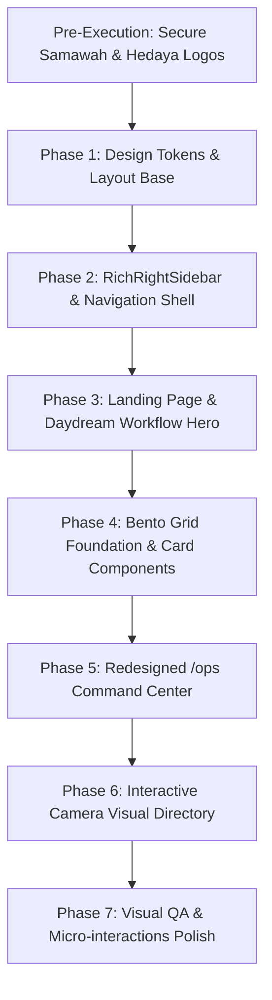

# RASD UI Redesign Plan

Local planning file for the next visual and product redesign phase.

Last updated: 2026-05-21

---

## Timing & Safety Constraints

Do not start the full redesign implementation until the core platform loop is fully confirmed:

1. Production login works seamlessly with `samawah.pod@gmail.com`.
2. Supabase Auth + user roles are stable for owner, editor, and viewer.
3. The platform reads persisted reports from Supabase.
4. The platform can ingest or display monitored X posts and news items.
5. Links, screenshots, statuses, and review state persist perfectly after server restarts.
6. `/client-report` shows real data, not only mock or static content.

**Development Constraint:**
During redesign execution, work must focus purely on modular UI improvements. Core database schemas and authentication flows should not be destructively altered.

---

## Design Direction & Reference Mood

The current `/ops` page and platform feel traditional and lack a premium, professional edge. The new direction aims for a highly professional, modern, and engaging aesthetic, moving away from generic templates.

Reference moods:
- **withdaydream.com (Workflow Animation & Visual Directory):** Seamless, interactive workflow animations, and beautiful, highly tactile directory libraries.
- **Notion (Calm & Clean Interface):** Cheerful, inviting, but highly professional color palette. Clean spacing, spacious padding, and polished micro-interactions.
- **Circle.so (Mega-navigation):** High-density, informative, and beautifully structured menus featuring clear titles, descriptions, and custom iconography.
- **Bento Grids (Asymmetric Information Layout):** Modern, responsive, and visually diverse grid layouts that group heterogeneous data card types beautifully.

---

## Visual Identity & Design Tokens

### Color Palette (Notion & Daydream Inspired)
The color system is cheerful, premium, and clean, ensuring high accessibility and visual comfort:

```css
:root {
  /* Brand Colors */
  --color-primary: #2383E2;         /* Notion Blue - Interactive / Primary buttons */
  --color-primary-hover: #1b6ec4;   /* Darker Blue for hover states */
  --color-success: #00C853;         /* Vibrant Green - Workflow success checkmarks */
  --color-warning: #FFAB00;         /* Warm Amber - Spikes / Attention needed */

  /* Surfaces & Backgrounds */
  --color-bg-main: #F7F7F5;         /* Calm, light warm-gray background */
  --color-bg-card: #FFFFFF;         /* Pure white for Bento cards */
  --color-bg-hover: #EFEFED;        /* Light hover state for list rows / items */

  /* Borders & Dividers */
  --color-border: #E6E6E6;          /* Crisp, soft border for separation */
  --color-border-focus: #2383E2;    /* Highlighted border color */

  /* Typography Colors */
  --color-text-title: #111111;      /* Deep ink for primary titles */
  --color-text-body: #37352F;       /* Soft dark gray for main body text */
  --color-text-muted: #737373;      /* Muted gray for subtitles & descriptions */

  /* Shadows & Glassmorphism */
  --shadow-sm: 0 1px 2px rgba(0, 0, 0, 0.05);
  --shadow-md: 0 4px 6px -1px rgba(0, 0, 0, 0.05), 0 2px 4px -1px rgba(0, 0, 0, 0.03);
  --shadow-premium: 0 10px 30px rgba(0, 0, 0, 0.04);
}
```

### Typography
- **Primary Font:** `IBM Plex Sans Arabic` - Used for maximum professional readability in headers, body text, tables, and operational logs.
- **Fallback Stack:** `font-family: "IBM Plex Sans Arabic", "Noto Sans Arabic", "Segoe UI", sans-serif;`
- **Rule:** Maintain crisp rendering and generous line-heights (`1.6` for body text, `1.3` for titles) to ensure readability in RTL layout mode.

---

## Pre-Execution Requirements (CRITICAL)

Before starting the UI components implementation, the executing agent **MUST** satisfy the following:
1. **Request Samawah Logo:** Prompt the user directly to provide the image file/asset for the **Samawah** logo.
2. **Obtain Hedaya Logo:** Attempt to automatically scrape or download the **Hedaya Hackathon** logo from `https://www.hedayathon.com/index.php`. If this fails or is ambiguous, the agent **MUST** ask the user to provide the Hedaya logo image asset.
3. **Verify Assets:** Save these assets locally inside the project's public folder (e.g., `public/assets/branding/`) before initializing UI coding.

---

## Feature Architectures

### 1. Main Entry / Landing Page
The entry portal routes users cleanly with an immersive, confidence-inspiring experience.

#### Layout Structure:
- A clean, centered layout with a subtle grid background.
- **The Hero Banner (Daydream-Style Workflow Animation):**
  - An animated horizontal timeline representing automated ingestion.
  - Nodes: `[سحب البيانات (Ingestion)]` ➡️ `[تصنيف بالذكاء الاصطناعي (Classification)]` ➡️ `[التدقيق البشري (Review)]` ➡️ `[توليد التقرير النهائي (Report Generation)]`.
  - **Animation Mechanics:** A glowing pulse moves from left to right along a connecting line. As the pulse reaches each node, a circular status indicator scales up, changes from gray to green (`var(--color-success)`), and a green SVG checkmark draws itself in (using CSS `stroke-dasharray` transition). The loop resets smoothly every 8 seconds.
- **Landing Choice Cards:**
  - Two massive, interactive, equal-weight bento-style cards:
    1. **"هداية هاكثون" (Hedaya Hackathon Portal)** - Features the Hedaya logo, direct reports access, and custom branding.
    2. **"غرفة الرصد الإعلامي" (Media Monitoring Room)** - Features the Samawah logo, full ingestion operations, and system metrics access.
  - Hover states should scale the cards by `1.02x` with a smooth 3D tilt effect, adding deep ink drop-shadows.

---

### 2. Product Shell & Descriptive Sidebar (Circle.so Style)
A fully responsive, RTL-oriented framework wrapping all internal dashboard pages.

```
+---------------------------------------------------------+
| [Samawah/Hedaya Logo]  [Workspace Title]     [User Profile] |
+---------------------------------------------------------+
|                                  |                      |
|                                  |  [DESCRIPTIVE SIDEBAR]|
|                                  |                      |
|                                  |  - Item 1            |
|                                  |    (Icon + Title)    |
|         [MAIN CONTENT]           |    (Subtitle)        |
|                                  |                      |
|                                  |  - Item 2            |
|                                  |    (Icon + Title)    |
|                                  |    (Subtitle)        |
|                                  |                      |
+---------------------------------------------------------+
```

#### Sidebar Navigation Details:
- **Position:** Fixed to the **Right side** (RTL).
- **Behavior:** Smooth flyout/sliding navigation on mobile, persistent on desktop.
- **Rich Elements (Circle.so style):** Each link item is a custom component wrapping:
  - **Icon:** A custom SVG icon inside a rounded pastel wrapper matching the page's theme.
  - **Title:** Dense, medium-weight Arabic label (14px, `var(--color-text-title)`).
  - **Description:** A tiny, light subtitle (11px, `var(--color-text-muted)`) explaining the page's functional goal in 2-3 words.

#### Menu Items Matrix:
- **لوحة الرصد (Overview Panel):** Icon: `TrendingUp` | Subtitle: "خلاصة الإحصائيات الفورية"
- **تلقيم البيانات (Data Ingestion):** Icon: `Database` | Subtitle: "استيراد ومعالجة الروابط"
- **مراجعة المحتوى (Content Review):** Icon: `CheckSquare` | Subtitle: "تنقيح وتدقيق التغريدات"
- **صفحة التشغيل (Operations `/ops`):** Icon: `Cpu` | Subtitle: "صحة ومراقبة الخوادم"
- **التقارير التنفيذية (Executive Reports):** Icon: `FileText` | Subtitle: "توليد ومشاركة التقارير"

---

### 3. Visual Directory: The Surveillance Camera Library
An interactive navigation dashboard modeled after `withdaydream.com/library`.

- **Visual Concept:** Instead of standard text boxes, display an isometric grid containing stylized, interactive **3D SVG shapes of Surveillance Cameras**.
- **Camera Configurations:**
  - **Dome Camera (كاميرا قبو):** Routes to "Content Review".
  - **PTZ Speed Dome (كاميرا متحركة):** Routes to "Operations / System Health".
  - **Bullet Camera (كاميرا خارجية):** Routes to "Data Ingestion / Import".
  - **Panoramic Camera (كاميرا بانورامية):** Routes to "Executive Reports".
- **Hover & Interaction Mechanics:**
  - On mouse hover, the chosen camera SVG rotates slightly on its 3D axis (using CSS `transform: rotateY() scale(1.1)`) and starts a slow "scanning" red-dot pulse.
  - A beautiful, floating detailed tooltip card fades and slides up smoothly. The card reveals:
    - **Page Title**
    - **Detailed Description of what the page contains**
    - **Current Live Status indicator (e.g., "Active - 3 active ingestion streams" or "Healthy - 99.8% uptime")**.

---

### 4. Data Layout: The Bento Grid System
Standard tables are upgraded to an asymmetric Bento Grid for high visual density and interest.

#### Grid Blueprint:
Utilize a CSS grid system with variable row heights and column spans:
```css
.bento-grid {
  display: grid;
  grid-template-columns: repeat(12, minmax(0, 1fr));
  gap: 16px;
}
```

#### Standard Bento Cards:
- **Card A (Span 3 Col, 1 Row):** Quick counter stat (Total coverage) with a line-spark graph.
- **Card B (Span 3 Col, 1 Row):** System status metric (Live Ingestion Status - pulsing).
- **Card C (Span 6 Col, 2 Rows):** Premium Date & Calendar control - integrated directly into the dashboard layout (no overlays). Features pre-selected ranges, custom quick filters, and a sleek modern date picker.
- **Card D (Span 8 Col, 3 Rows):** Live Monitored X/News Feed - card containing custom bento rows for Tweets (featuring avatar, handle, tweet content, platform badge, media attachments, and quick-action validation toggles).
- **Card E (Span 4 Col, 3 Rows):** Live platform distribution stats (Beautiful donut chart showing percentage of news vs. tweets).

---

### 5. Overhauling `/ops` (System Health & Operations)
Transform the existing traditional operations screen into a stunning, operational command center.

#### Key Sections:
- **Real-Time Data Ingestion Flow (Daydream Animated Banner style):**
  - An animated pipeline dashboard showing active background tasks pulling X posts.
  - Success events trigger instant green checkmarks that light up and fade out.
- **Bento Infrastructure Widgets:**
  - **Database Connection Status:** Interactive visual showing live Supabase connection status.
  - **API Rate Limits Panel:** Progress rings showing remaining tokens for external scrapers.
  - **Error Logs Container:** High-density, scrollable terminal-style panel with custom filters (Errors, Warnings, Success) styled in a dark-mode card for a cool contrast effect.
  - **Manual Trigger Controls:** Highly polished, micro-animated buttons (e.g., "Start Data Ingestion Cycle") that transition smoothly to a spinning loader state with absolute safety protection (preventing double clicks).

---

## Component Specifications (Technical Blueprint)

### `RichRightSidebar.jsx`
```javascript
// RTL Structure
<aside className="fixed right-0 top-0 h-full w-80 bg-white border-l border-e6e6e6 flex flex-col z-50">
  <div className="p-6 border-b border-e6e6e6 flex items-center justify-between">
    
    <span className="text-111111 font-bold text-sm">منصة رصد</span>
  </div>
  <nav className="flex-1 p-4 space-y-2 overflow-y-auto">
    {menuItems.map(item => (
      <NavLink key={item.path} to={item.path} className="flex items-center gap-4 p-3 rounded-lg hover:bg-efefed transition-colors duration-200">
        <div className="w-10 h-10 rounded-full bg-2383e2/10 flex items-center justify-center text-2383e2">
          {item.icon}
        </div>
        <div className="flex flex-col text-right">
          <span className="text-sm font-semibold text-111111">{item.title}</span>
          <span className="text-xs text-737373">{item.subtitle}</span>
        </div>
      </NavLink>
    ))}
  </nav>
</aside>
```

### `BentoCard.jsx`
```javascript
const BentoCard = ({ children, colSpan = 'span-4', rowSpan = 'span-1', title }) => (
  <div className={`col-span-12 md:col-${colSpan} md:row-${rowSpan} bg-white rounded-2xl border border-e6e6e6 p-6 shadow-sm hover:shadow-md transition-shadow duration-300 flex flex-col justify-between`}>
    {title && <h3 className="text-xs font-bold uppercase tracking-wider text-737373 mb-4">{title}</h3>}
    <div className="flex-1">{children}</div>
  </div>
);
```

---

## Implementation Roadmap



### Phase Details

#### Phase 1: Foundation & Branding Assets
- **Actions:** Load confirmed Samawah logo and Hedaya logo into the project codebase. Map the custom CSS custom properties (variables) into `index.css`. Set IBM Plex Sans Arabic as the default platform font.

#### Phase 2: Shell & Sidebar
- **Actions:** Replace traditional header/sidebar layout with the RTL `RichRightSidebar` component. Integrate specific icons and Arabic subtitles. Build dynamic logo rendering (Hedaya on client-reports, Samawah everywhere else).

#### Phase 3: Portal Landing Page
- **Actions:** Construct the portal landing page containing the `LandingChoiceCards`. Build the CSS/SVG custom animated timeline banner illustrating the media monitoring workflow using smooth checkmark keyframe sequences.

#### Phase 4: Bento Layout Integration
- **Actions:** Refactor dashboards into a modular `BentoGrid` system. Convert raw data lists into stylized `BentoCard` formats representing Tweets, News, and embedded Filter modules.

#### Phase 5: `/ops` Dashboard Overhaul
- **Actions:** Rebuild `/ops` into a command console. Integrate terminal-like log systems, rate limits circular indicators, Supabase connection indicators, and functional backfill ingestion workflows.

#### Phase 6: Interactive Camera Directory
- **Actions:** Create the `SurveillanceCameraDirectory` navigation node. Render distinct camera types as inline responsive SVGs, adding deep hover events that reveal rich page previews on focus.

#### Phase 7: Polish & Micro-animations
- **Actions:** Rigorously polish transitions, add skeletons, tune hover effects, and test responsive scaling on mobile break-points.

---

## Acceptance Criteria for Redesign Phase

The implementation is verified successful only when:
- **Zero Schema/Logic Regression:** Core Supabase endpoints, login methods, and data ingestion processes are 100% untouched and functional.
- **Flawless RTL Layout:** The right sidebar works flawlessly on all modern browsers (Chrome, Safari, Firefox, Edge) without horizontal page overflow.
- **Satisfying "Wow" Factor:** Hover states, checkmark pipeline animations, and the interactive camera directory operate seamlessly at 60 FPS without dropping frames.
- **Clear Routing:** The landing portal clearly and beautifully directs users to "هداية هاكثون" (branded) or "غرفة الرصد الإعلامي" (Samawah branded).
- **Notion Palette Accuracy:** Surfaces use the defined Notion-style gray backgrounds and clean white cards rather than raw primary colors or generic Bootstrap styling.
- **RTL Typography Excellence:** The Arabic text displays fully in IBM Plex Sans Arabic with correct spacing and zero line-clipping.
